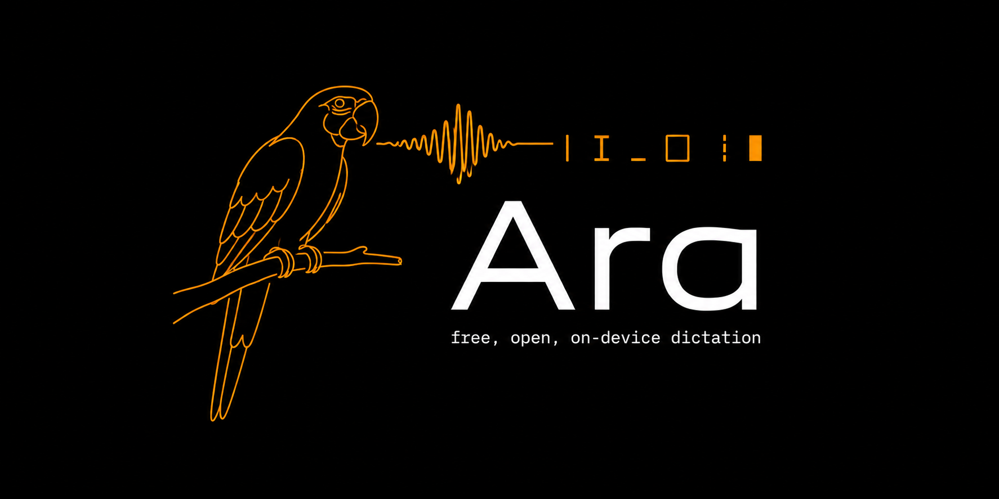

<p align="center">
  
</p>

# Ara

A free macOS dictation daemon. Hold a key, speak, release — the text appears at
your cursor. Transcription and AI cleanup both run on your Mac, on open-weights
models. A fork of [digimata/parrot](https://github.com/digimata/parrot),
building toward [feature parity](#feature-parity) with the paid dictation apps
while staying free, local, and open.

## The open-model approach

Everything that touches your voice runs on your machine, on open-weights
models, at no cost:

- **Transcription** is Whisper (OpenAI's open speech model) running on the
  Apple Neural Engine via WhisperKit. No audio leaves the Mac.
- **Cleanup** — filler removal, punctuation, capitalisation, per-app tone — is
  Qwen 2.5 (Alibaba's open 1.5B model, Apache-licensed) running locally on MLX,
  Apple's ML framework. Measured on an M3 Pro through the shipped prompt, it
  formats a dictated sentence in 787 ms median and 888 ms worst case, against
  the chain's 2500 ms budget. No API key, no account, no subscription, no
  server.
- **Corrections** — the custom dictionary — are a deterministic pass over the
  transcript, applied before any model sees it. Plain JSON on disk, yours to
  edit.
- **Fallbacks never lose your words.** If a model is missing, slow, or wrong,
  the transcript falls through to rule-based cleanup and is typed anyway. The
  language model is polish, not a dependency.

Cloud formatting exists as an *opt-in* (`engine: "cloud"` with your own key)
and Apple Intelligence as another (`engine: "apple"`); the default install
makes zero network requests for formatting. The paid competition inverts this:
Wispr Flow sends every dictation — with surrounding screen context — to their
servers, and SuperWhisper gates its larger models and translation behind a
subscription. Ara's bet is that open models on Apple Silicon are already good
enough that dictation software has no business charging rent or reading your
screen.

## Install

**Requires:** macOS 14+ on Apple Silicon (M1 or newer). Transcription runs on
the Apple Neural Engine via CoreML, so Intel is not supported. The default
formatting engine additionally needs macOS 15.4 — below that it is skipped and
cleanup is rule-based, which `ara doctor` reports.

### The installer

One command, no sudo:

```sh
curl -fsSL https://karniej.github.io/ara-parrot/install.sh | sh
```

It resolves the latest release, downloads `Ara-<version>.dmg`, checks it
against the published `sha256` and **refuses to install on a mismatch**, mounts
it, and installs to `~/Applications/Ara.app` with a symlink at
`~/.local/bin/ara` so `ara …` works from a terminal. It also strips the
quarantine flag, so there is no right-click dance on this path. If
`~/.local/bin` is not on your `PATH` it tells you how to add it.

Both destinations are per-user by default — a `curl | sh` that asks for a
password you cannot audit at the moment it asks is a bad trade. For a
machine-wide install, opt in explicitly:

```sh
ARA_APP_DIR=/Applications ARA_BIN_DIR=/usr/local/bin \
  sh -c "$(curl -fsSL https://karniej.github.io/ara-parrot/install.sh)"
```

If a release ever publishes the bare CLI tarball instead of a DMG, the
installer handles that too — you get `ara` on your `PATH` and no app bundle,
which means no Info.plist and a process running under the identity of whatever
launched it.

### From the DMG, by hand

[**Download `Ara-<version>.dmg`**](https://github.com/Karniej/ara-parrot/releases/latest)
from the releases page — 0.1.0 ships it, alongside `Ara-0.1.0.dmg.sha256`.

1. Verify it, since unsigned means the checksum is the only integrity check
   there is: `shasum -a 256 Ara-<version>.dmg` against the published
   `.sha256`.
2. Open the image and drag **Ara** onto **Applications**.
3. Launch it. Builds are unsigned, so a hand-downloaded app needs
   **right-click → Open** on the *first* launch rather than a double-click —
   see [Unsigned builds](#unsigned-builds). (The installer above avoids this
   by stripping the quarantine flag for you.)
4. Ara is a menu-bar app: no Dock icon, no window, no app-switcher entry. The
   bird in the status bar is the whole interface. macOS will ask for the
   microphone the first time you dictate, and for Accessibility (which is what
   lets it read the `fn` key and type at your cursor) from
   **System Settings → Privacy & Security**.
5. The local formatting model is a separate one-time ~900 MB download, and it
   is always a terminal command — the menu's **Download formatting model…**
   item shows you the command and copies it, it never fetches anything itself:

   ```sh
   /Applications/Ara.app/Contents/MacOS/ara models download-formatter
   ```

The app bundle contains the same `ara` CLI, so every command below works from
it. Put it on your `PATH` if you want `ara` from anywhere:

```sh
ln -sf /Applications/Ara.app/Contents/MacOS/ara ~/.local/bin/ara
```

`ara install --launch-at-login` then registers the login agent, and — running
from inside the bundle — points it at `Ara.app`, not at any older
`/usr/local/bin/ara` you may still have.

### From source

For the current `master` rather than the last release, or to hack on it. One
build command plus a Metal step:

```sh
git clone https://github.com/Karniej/ara-parrot.git && cd ara-parrot
swift build -c release
scripts/build-metallib.sh                       # compiles the Metal kernels SwiftPM cannot
./.build/release/ara models download-formatter  # the local formatting model, ~900 MB, once
./.build/release/ara setup                      # microphone + accessibility permissions
./.build/release/ara                            # run it
```

Put it on your `PATH` if you want `ara` from anywhere:

```sh
ln -sf "$PWD/.build/release/ara" ~/.local/bin/ara
```

Then `ara install --launch-at-login` registers the background daemon, which is
the recommended way to run it: models warm once at login instead of on every
launch. See [Build from source](#build-from-source) for what each step does.

A source build has no bundle, so it runs as a plain process under whatever
terminal launched it: it inherits that terminal's microphone and accessibility
grants, and `ara --version` reports `source build (unversioned)` rather than a
release number.

### Unsigned builds

Ara has no Apple Developer ID certificate, so nothing it ships is signed or
notarized. What that means when you download the DMG:

- macOS attaches `com.apple.quarantine` to anything downloaded, and Gatekeeper
  refuses to launch a quarantined app that is neither signed nor notarized. A
  double-click gets *"cannot be opened because the developer cannot be
  verified"* — which is not a claim that anything is wrong with the app; it is
  what "unsigned" looks like. The bundle *is* ad-hoc signed by
  `scripts/package-app.sh`, so it is structurally valid and Gatekeeper's
  consent path works; what it lacks is a Developer ID and a notary ticket.
- **Right-click the app → Open → Open** once. That records your consent and
  every later launch is a normal double-click.
- Or strip the flag yourself:

  ```sh
  xattr -dr com.apple.quarantine ~/Applications/Ara.app
  ```

  This is exactly what the `install.sh` one-liner does for you, which is why
  that path never shows the dialog.
- Verify what you got against the image's `sha256`. 0.1.0 publishes it as a
  release asset (`Ara-0.1.0.dmg.sha256`), `package-dmg.sh` prints it when it
  builds an image locally, and the installer checks it automatically and
  aborts on a mismatch. By hand: `shasum -a 256 Ara-<version>.dmg`. Unsigned
  means the checksum is the only integrity check there is, so it is worth
  actually running.

Signing is not a thing this repo can do for you — the certificate belongs to an
Apple developer account. For a maintainer who has one, the commands are:

```sh
scripts/package-app.sh
codesign --force --options runtime --timestamp \
    --sign "Developer ID Application: NAME (TEAMID)" dist/Ara.app
scripts/package-dmg.sh                       # rebuild the image around the signed app
xcrun notarytool submit dist/Ara-<version>.dmg \
    --keychain-profile "AC_PASSWORD" --wait
xcrun stapler staple dist/Ara-<version>.dmg
```

(`--deep` is deliberately absent: Apple documents it as a verification
convenience and discourages it for signing. Ara's bundle has no nested code
beyond the Metal kernel library, which `package-app.sh` signs first.) The DMG
has to be rebuilt between signing and submission — an image built around the
unsigned app stays unsigned no matter what happens to `dist/Ara.app`
afterwards. With the ticket stapled, Gatekeeper stops objecting. Note that
`--options runtime` (the hardened runtime) is required for notarization and is
also what makes the microphone and accessibility entitlements stick to the
bundle rather than to whoever launched it.

### Upgrading from `parrot`

This tool used to be called `parrot`. The binary is now `ara`, and that is the
only thing that moves.

**The background daemon.** The LaunchAgent's label changed too
(`com.digimata.parrot` → `com.silpho.ara`), and launchd sees no connection
between the two — left alone, the old agent goes on starting the old binary at
every login, so enabling Start at Login would leave two daemons fighting over
the hotkey. You do not have to clean that up by hand: both
`ara install --launch-at-login` and `ara install --uninstall` boot the old
agent out and delete its plist, printing the path they removed. `ara doctor`
warns while one is still there.

**A symlink on your `PATH`.** If you had `~/.local/bin/parrot` pointing at a
build directory, repoint it — the built binary has a new name:

```sh
ln -sf "$(pwd)/.build/release/ara" ~/.local/bin/ara && rm -f ~/.local/bin/parrot
```

**Your settings.** Nothing to do. The config directory has been `~/.config/ara/`
since before the rename, so `config.json`, `dictionary.json` and
`snippets.json` are already where the new binary looks — same paths, same
contents, no migration step. One older *spelling* still works too:
`"engine": "local"` decodes as `"apple"`.

**The old transcript logs.** `/tmp/parrot.out.log` and `/tmp/parrot.err.log`
keep those names forever: they are files already on your disk, not branding, so
that is what `ara install --purge-legacy-logs` still looks for. See
[Privacy](#privacy) for the order to run things in.

## First run

**Permissions.** Ara needs two, and `ara setup` walks you through both:

- **Accessibility**, for the global event tap that sees the hotkey and for
  synthesizing the keystrokes that type your text. macOS only picks up this
  grant on a fresh process, so `ara setup` opens the prompt and asks you to
  re-run it.
- **Microphone**, requested the first time audio is captured.

Run from a terminal, both grants attach to the *terminal*, not to Ara — that is
how macOS files permissions for a process with no bundle. Switching terminals
means granting again. Run from `Ara.app` and they attach to the bundle
identifier `com.silpho.ara` instead. `ara setup` does not download anything;
models are `ara models download` and `ara models download-formatter`.

**Warm-up.** The menu bar bird appears immediately and its first line reads
`warming up models…`. The hotkey is **not armed** during this window — holding
it does nothing, by design.

Two loads run concurrently — Whisper's ANE prewarm and the MLX formatting
model — so startup costs roughly the larger of the two rather than their sum.
**Expect about 6–10 seconds on a warm start**, dominated by Whisper. Measured
on 2026-07-30, M3 Pro, release build: two full startups reached `listening` in
9.51 s and 5.91 s, with Whisper's phase 4.0–7.7 s and MLX's load-plus-priming
1.0–5.2 s across five runs. That MLX spread is contention, not noise: the phase
takes about a second when it runs alone and several seconds when it overlaps
Whisper's prewarm, which is the trade concurrency buys — a slower MLX phase for
a faster total. A genuinely first run is download-sized instead.

When `listening on <key> hold` prints, the state line flips to
`idle · hold <key> to dictate` and the key is live.

If the *transcription* model fails to load, the daemon prints `warmup failed:`
and exits. If the *formatting* model fails, it prints
`! local formatting unavailable:` with the fix, arms the hotkey anyway, and
every dictation gets rule-based cleanup.

**Your first dictation.**

1. Click into a text field — Messages, an address bar, a Slack thread, anywhere
   a cursor blinks.
2. Hold `fn`, speak, release. A small pill appears at the bottom of the screen
   with a live waveform while the mic is hot, then a spinner while it works.
3. The text appears at the cursor.

There is no record button, no stop button, no "send" — the hotkey is the whole
interface.

**How to tell it worked.** Run in a terminal and each utterance prints three
lines: `● recording`, then `○ captured 1.84s · rms 0.021`, then
`→ 1.33s · 42 chars` for the raw transcript. A fourth line, `↦ 2.10s · 39
chars`, appears only when cleanup changed something — its absence means the
text was typed exactly as transcribed. Timings are real numbers from an M3 Pro
with `whisper-base.en`: 2.89 s of audio transcribed in 1.33 s, formatting
adding 787 ms median on top. Any line beginning `formatting:` means an engine
fell through to the next one; any line beginning `config:` means part of your
config file did not take effect.

> **Note:** on most modern Macs the `fn` key is the bottom-left key. If yours is
> set to "Change input source" or "Show emoji & symbols," `ara doctor` will
> fail that check and tell you to set **System Settings → Keyboard →
> Press 🌐 key to → Do Nothing**. Fn also only works on Apple's built-in
> keyboard; on anything else pick another key with `--hotkey`.

## Everything it does

**Local AI cleanup, per app.** Every transcript goes through a formatting
engine before it is typed. Which style it uses is a *mode*, resolved per
utterance in this order: the `--mode` flag, then a menu-bar pick, then the
frontmost application, then the `mode` config key.

| Mode | What it does | Auto-selected in |
|---|---|---|
| `verbatim` | no language model at all; the rules floor only | — |
| `default` | remove fillers and false starts, repair sentence boundaries and capitalisation, preserve wording | everything unmapped |
| `email` | polished email prose with paragraph breaks; never invents a greeting or sign-off | Mail, Spark |
| `chat` | terse message, no greeting or pleasantries | Slack, Discord, Messages |
| `code` | concise technical note; identifiers, file paths and symbols preserved exactly | VS Code, Xcode, Cursor, and the terminals — Terminal, iTerm2, kitty, Alacritty, WezTerm |

Controlled by the **Mode** menu (session override, applies to the next
utterance) or the `mode` config key (the startup default).

**Cleanup intensity.** Orthogonal to the mode: the mode says what the text
should sound like, the intensity says how far from your spoken words the editor
may go. `none` skips the language model entirely (fillers still stripped),
`light` adds punctuation and capitalisation but keeps every spoken word,
`medium` (the default) also removes fillers, collapses spoken self-corrections
("we ship Tuesday, no wait, Wednesday" → "We ship Wednesday.") and obeys
dictated punctuation ("comma", "period", "question mark"), and `high` also
restructures fragments into complete sentences and formats spoken enumerations
("number one… number two…") as numbered lists. Controlled by the **Cleanup**
menu or the `cleanup` config key; both take effect on restart. Two measured
limits — dictated "new line"/"new paragraph" become a sentence break rather
than a real line break, and enumerations only become lists at `high` — are
recorded in [docs/KNOWN-ISSUES.md](docs/KNOWN-ISSUES.md).

**Custom dictionary.** Words Whisper reliably mishears — your name, your
product, your city — rewritten deterministically before any model sees the
text. `~/.config/ara/dictionary.json`, or the **Add dictionary correction…**
menu form. Applies to the next utterance, no restart. See
[Dictionary](#dictionary).

**Voice snippets.** Dictate a trigger phrase, get a block of text typed
instead — a scheduling link, an email sign-off, an address. The expansion is
typed verbatim; no formatting engine ever sees it.
`~/.config/ara/snippets.json`, or **Edit snippets…** in the menu. See
[Snippets](#snippets).

**Microphone picking and disconnect survival.** Records from the system default
input, live, unless you pin one in the **Microphone** menu. A pinned mic that
unplugs falls back to whatever remains and returns by itself on replug. A mic
that dies mid-dictation does not cost you the utterance: recording continues on
the fallback, and when there is nothing left the pill says `no microphone` and
everything captured so far is kept. See [Microphone](#microphone).

**Paste vs typing delivery.** Typing synthesizes keystrokes and leaves your
pasteboard alone; terminals and Electron apps silently drop synthesized
unicode, so those get a snapshot-paste-restore instead. `auto` (the default)
picks per app. See [Injection: typing vs paste](#injection-typing-vs-paste).

**Privacy by default.** No audio, no transcript, and no screen contents leave
the machine on a default install. Logs carry lengths, not text. See
[Privacy](#privacy).

## The menu bar

The bird in the menu bar is the daemon's whole control surface. Three disabled
lines up top report state: what the daemon is doing, the transcription model it
is running, and the mode the last utterance resolved to. The state line reads
`warming up models…`, `idle · hold <key> to dictate`, `● recording`,
`transcribing…`, or `no microphone`.

Below them, what each item does and — the part worth reading — *when* it takes
effect:

| Item | What it does | Applies |
|---|---|---|
| **Microphone** | pick an input device, or **System default**; saved to `microphone`. Shows `preferred mic disconnected — using <device>` or `no microphone connected` when either is true | next utterance |
| **Cleanup** | editing intensity `none`/`light`/`medium`/`high`; saved to `cleanup` | on restart |
| **Language** | **Automatic**, or tick the languages you dictate in; saved to `language`. Ticking one language pins it — one decoder pass, nothing to misdetect. Ticking two or more monitors that set. On an English-only model every row is dead and the caption says which models are not | next utterance |
| **Mode** | **Auto (per app)** or a pinned mode; deliberately *never* saved — it is a session override, and the `mode` key stays your startup default | next utterance |
| **Model** | pick a transcription model, shown with its size; saved to `model`; a model not on disk is downloaded by the next launch's warm-up | on restart |
| **Model → formatting-model line** | reads `Formatting model: ✓ downloaded`, or offers `Download formatting model… (900 MB, applies on restart)`, which opens an alert naming `ara models download-formatter` with a **Copy command** button. Nothing is ever fetched in-process | on restart |
| **Hotkey** | pick the push-to-talk key from all eight; saved to `hotkey` | on restart |
| **Engine** | `mlx` / `apple` / `cloud` / `rules` / `off`; saved to `engine`. The cloud row reads `cloud (no API key set)` when the daemon started without one — opening the submenu never touches the keychain | on restart |
| **Add dictionary correction…** | a two-field form: what dictation heard, what it should have typed. An empty field does nothing | next utterance |
| **Edit dictionary…** / **Edit snippets…** | opens the file in your default JSON editor, writing a one-entry starter first if it does not exist. An existing file — even a broken one — is never touched | next utterance |
| **Start at Login** | installs or removes the LaunchAgent; the checkmark is a fresh read of the plist on disk. Enabling *starts the login copy immediately*, and says so — quit a terminal-run daemon after enabling, or two daemons answer the hotkey | immediately |
| **Run Diagnostics…** | `ara doctor`'s report in a window, monospaced, with a **Copy report** button | — |
| **Quit Ara** | quits (⌘Q) | immediately |

Every submenu whose pick is not immediate states its timing in a caption
underneath, so the menu never claims a restart-bound pick changed the running
session. Microphone and Mode need no caption, because they apply at once.
Language has one anyway — it is the only submenu that both applies to the next
utterance *and* persists, and a caption that said "on restart" alongside the
Model and Engine ones would be a lie in the other direction.

A pick that could not be saved — an unwritable config file, or one whose top
level is not a JSON object — keeps the old checkmark and warns on stderr. The
file is never overwritten with a guess, and a successful save rewrites exactly
one key: every other key survives, including keys this version of Ara has never
heard of.

## Command reference

`ara` with no subcommand runs the daemon. Every command below also works from
`Ara.app/Contents/MacOS/ara`.

| Command | What it does |
|---|---|
| `ara` / `ara run` | run the daemon in the foreground (^C to quit) |
| `ara setup` | walk through first-run permission setup |
| `ara doctor` | check microphone, accessibility, and Fn key configuration |
| `ara models list` | list the transcription models, `★` marking the recommended one |
| `ara models download <id>` | pre-download a transcription model |
| `ara models download-formatter` | download the local formatting model (~900 MB, one time) |
| `ara dictionary` | print the dictionary file's path and every correction |
| `ara snippets` | print the snippets file's path and every trigger |
| `ara install --launch-at-login` | register the LaunchAgent and start the login copy now |
| `ara install --uninstall` | remove the LaunchAgent (both the current and pre-rename labels) |
| `ara install --purge-legacy-logs` | delete the world-readable `/tmp/parrot.{out,err}.log` files earlier versions wrote transcripts to. Combines with either flag above |
| `ara --version` | the release number, or `source build (unversioned)` |
| `ara --help` | usage; `ara <subcommand> --help` for a subcommand |

Flags on `ara run`:

| Flag | What it does |
|---|---|
| `--model <id>` | transcription model. Defaults to `config.model`, then the recommended model. An unknown id exits 1 |
| `--hotkey <key>` | push-to-talk key: `fn`, `left-option`, `right-option`, `left-command`, `right-command`, `left-control`, `right-control`, `right-shift`. Defaults to `config.hotkey`, then `fn`. Fn only works on Apple's built-in keyboard |
| `--mode <mode>` | output mode: `verbatim`, `default`, `email`, `chat`, `code`. An unknown mode exits 1 |
| `--inject <method>` | `auto`, `type`, or `paste`. Defaults to `config.inject`, then `auto` |
| `--no-overlay` | disable the on-screen recording pill |
| `--echo-transcripts` | print full transcript text to stderr. Everything you dictate appears in any log that captures stderr — off by default, and the LaunchAgent never sets it |
| `--skip-doctor` | skip the permission checks at startup. The LaunchAgent uses this |
| `--debug-hotkey` | print every keyboard event the tap sees |
| `--dump-wav` | write each capture to `/tmp/ara-last.wav` for inspection |

Precedence for every setting that has both a flag and a config key is **CLI
flag > config > default**. A bad flag is fatal — you just typed it and can
retype it. A bad config value is not; see the next section.

## Configuration reference

Optional, at `~/.config/ara/config.json`. Every key is optional; an absent file
is the normal case and says nothing.

```json
{"engine": "mlx", "cleanup": "medium", "mode": "default",
 "hotkey": "right-command", "model": "whisper-base.en",
 "inject": "auto", "pasteRestoreMs": 300, "timeoutMs": 2500,
 "language": ["en", "pl"],
 "microphone": "AppleUSBAudioEngine:Blue:Yeti:123:1"}
```

| Key | Type | Default | What it does | A bad value |
|---|---|---|---|---|
| `engine` | `"mlx"`, `"apple"`, `"cloud"`, `"rules"`, `"off"` | `"mlx"` | which formatting engine the chain prefers. `"local"` is accepted as an old spelling of `"apple"` | **discards the whole file** |
| `cleanup` | `"none"`, `"light"`, `"medium"`, `"high"` | `"medium"` | how aggressively dictation is edited | warns, uses `medium`; the rest of the file survives |
| `mode` | a mode id | `"default"` | the startup mode, before the frontmost app or a menu pick gets a say | warns `unknown mode in config:`, uses `default`; a non-string discards the whole file |
| `hotkey` | a key name (see `--hotkey`) | `fn` | push-to-talk key | warns, uses `fn`; a non-string discards the whole file |
| `model` | a model id | the recommended model | transcription model | warns, uses the recommended model; a non-string discards the whole file |
| `inject` | `"auto"`, `"type"`, `"paste"` | `"auto"` | how transcripts are delivered | warns, uses `auto`; a non-string discards the whole file |
| `pasteRestoreMs` | int | `300` | how long the target app gets to service the ⌘V before your pasteboard is restored | clamped to 50–5000 with a warning; a non-int discards the whole file |
| `timeoutMs` | int | `2500` | deadline **per formatter**, not a total budget — under `cloud` a hung cloud then a hung MLX costs two of these before the rules floor runs | clamped up to 50 with a warning; a non-int discards the whole file |
| `microphone` | Core Audio device UID | absent — follow the system default | pins an input device. The menu writes this; there is no reason to type one by hand | warns, uses the default input; the rest of the file survives |
| `language` | `"auto"`, one code (`"pl"`), or a list (`["en","pl"]` or `"en,pl"`) | `"auto"` | which language(s) dictation is transcribed in — see [Languages](#languages) | warns, naming the bad code, and detects automatically; the rest of the file survives |
| `cloud` | object | absent — no cloud formatter is built at all | `provider` (default `"anthropic"`), `model` (default `"claude-opus-5"`), `keychainAccount` (default `"ara-cloud"`). A `provider` other than `anthropic` disables the formatter rather than sending that vendor's key here | a wrongly-typed sub-key discards the whole file |

**"Discards the whole file" is the important asymmetry.** Three keys —
`cleanup`, `language` and `microphone` — are decoded defensively and fail alone. Every
other key fails the whole decode, so a single typo like `{"engine": "clod"}`
means *no* key in your file takes effect, including a perfectly good `cloud`
section. That is loud, not silent: it prints one line naming the file, the key,
and the bad value. **Any line starting `config:` means part of your file did not
take effect.** The daemon never refuses to start over a config file.

The API key never goes in this file. It lives in the keychain, under service
`com.silpho.ara` and the account `keychainAccount` names. A key stored under
the older `com.digimata.ara` service still works — that name is read as a
fallback — but nothing writes there any more, and there is no automatic
migration: the write that would move it raises a keychain prompt, so it is left
for you to redo when convenient. No subcommand writes the key yet either — see
[docs/KNOWN-ISSUES.md](docs/KNOWN-ISSUES.md).

## Injection: typing vs paste

Ara has two ways to deliver a transcript, controlled by the `inject` key (or
`--inject`):

- **`type`** synthesizes the characters as keyboard events, 20 UTF-16 units at
  a time. It leaves your pasteboard alone, but terminals and Electron apps
  (VS Code, Slack, Discord…) drop or mangle synthesized unicode typing — the
  platform API reports success either way, so the failure is silently missing
  characters.
- **`paste`** snapshots your pasteboard, puts the transcript on it, sends ⌘V,
  and restores the snapshot a moment later. This is what every serious
  dictation tool does in those apps, because paste is the one path they all
  handle correctly.
- **`auto`** (the default) pastes into a built-in list of terminals and
  Electron apps — Terminal, iTerm2, VS Code, Cursor, Slack, Discord, kitty,
  Alacritty, WezTerm — and types everywhere else, including when the frontmost
  app cannot be identified.

The paste path is careful with your pasteboard:

- The snapshot keeps **every representation of every item**, so a copied image
  or file survives the round trip intact.
- The transcript is marked `org.nspasteboard.TransientType`, so clipboard
  managers that honour the convention will not record it.
- Items marked `org.nspasteboard.ConcealedType` — password-manager copies — are
  deliberately **not restored**, and are filtered out at snapshot time so their
  bytes never sit in Ara's memory at all. They are ephemeral by their
  producer's design; putting a password back on the pasteboard after its
  manager retired it would be a leak. Copy the password again if you need it
  after dictating.
- Anything **you** copy during the restore window wins: the restore checks the
  pasteboard's change count and stands down rather than overwrite a ⌘C you just
  made in another app.
- Overlapping dictations restore your pasteboard exactly once. The second
  utterance does not snapshot the first one's transcript, and the first one's
  timer does not restore underneath the second's paste.
- `pasteRestoreMs` (default 300, clamped to 50–5000) is how long the target app
  gets to service the ⌘V before the snapshot is restored. Too low and a slow
  app pastes your *old* pasteboard instead of the transcript; higher values
  just mean the transcript sits on the pasteboard longer after each dictation
  (a ⌘V of your own in that window pastes the transcript). Raise it if a laggy
  app — a remote-desktop session, a busy Electron app — pastes stale content.
- If the pasteboard write or the ⌘V synthesis fails, your pasteboard is
  restored immediately and the transcript is delivered through the typing path
  instead. It is never lost.

Dvorak and Colemak users should set `"inject": "type"` for now: the synthesized
⌘V assumes keycode 9 is `v`, which those layouts rearrange. That is recorded in
[docs/KNOWN-ISSUES.md](docs/KNOWN-ISSUES.md).

## Microphone

By default Ara records from the system default input, live — change it in
System Settings and the next dictation follows. To pin a specific mic instead,
use the menu bar item → **Microphone** and pick one; the choice is saved to the
config file as a Core Audio device UID, which survives replug and reboot, and
only that key is touched. Picking **System default** clears it. Ara never
writes the *system's* default input; routing is applied to its own audio engine
only.

If the picked mic is unplugged, Ara falls back — to the system default input,
or to the first available input when the default is not usable — until it
returns. The submenu says so, and shows no checkmark on any row: your pick is
remembered, not silently rewritten.

A mic that dies mid-dictation does not lose the utterance: recording rebuilds
onto whatever input remains and continues into the same buffer. When nothing
remains, the pill reads `no microphone`, the menu's state line says the same,
and everything captured so far is kept — plugging a mic in before you release
the key resumes the *same* utterance, and releasing transcribes what was
captured up to the loss.

## Languages

The default model, `whisper-base.en`, only speaks English — that is what the
`.en` in its name means. Dictating another language needs a multilingual model
(`ara models list`; `whisper-large-v3-turbo` is the one on offer, 1.6 GB), and
then the `language` key or the menu bar item → **Language**.

Three settings, in increasing order of cost:

- **One language** — `"language": "pl"`, or tick exactly one in the menu. The
  decoder is told which language up front: one pass, and a two-word utterance
  cannot be misheard as another language. Pick this if you dictate in one
  language. It is faster *and* more accurate than detection.
- **Several languages** — `"language": ["en", "pl"]`, or tick two or more.
  Whisper detects, but its answer is confined to the languages you listed, and
  a marginal call goes to the language your **previous** utterance was in — so
  a session does not flap between two languages on the strength of a short
  "tak, jasne". When the detection disagrees with your last utterance, Ara
  transcribes a second time in the previous language and compares the two by
  the decoder's own mean log-probability — a heuristic, and one whose
  calibration across languages is unverified; see
  [docs/KNOWN-ISSUES.md](docs/KNOWN-ISSUES.md). What is guaranteed is the
  floor: a second pass can change which language you get, never turn a
  transcribed utterance into an empty one. That second pass is the cost:
  roughly double the transcription phase — single-sample measurements on an
  M-series Mac with `whisper-large-v3-turbo` put six seconds of speech at
  ~0.85 s pinned and ~1.8 s when the second pass runs, but run-to-run
  variance on the same clip was wide enough that these are orders of
  magnitude, not benchmarks.
- **Automatic** — `"language": "auto"`, the default, and what an absent key
  means. Whisper detects freely and whatever it says goes. Right if you dictate
  in languages you cannot enumerate; otherwise one of the above is better.

On an English-only model all of this is inert: there is no language to detect
and no language token to set, so the setting changes nothing, every row in the
submenu is disabled, and a non-English `language` gets one `config:` line at
startup saying it cannot work and which models can.

The menu offers fourteen common languages. Any of Whisper's 99 codes works if
you write it into the config by hand; an unknown one warns at startup, naming
the code, and Ara detects automatically instead.

The language a given utterance was transcribed in is logged to stderr —
`language: pl · detected` — along with how it was decided.

## Dictionary

Whisper will mishear the same words every time — your name, your product, your
city. The dictionary fixes those deterministically, before any formatting
engine runs: menu bar item → **Add dictionary correction…**, type what
dictation heard and what it should have typed, done. The very next utterance is
corrected — no restart, nothing to reload.

Corrections live at `~/.config/ara/dictionary.json`, next to the config, and
the file is meant to be hand-edited too — it is written pretty-printed with
stable ordering for exactly that reason. A file with two corrections in it
looks like this:

```json
[
  {
    "canonical" : "Ara",
    "variants" : [
      "arra",
      "aara"
    ]
  },
  {
    "canonical" : "Kraków",
    "variants" : [
      "krakuf"
    ]
  }
]
```

Matching is case-insensitive and whole-word only, with Unicode-aware
boundaries — `arra` never fires inside `arrabbiata`, and a Polish diacritic
next to a variant blocks the match the way a letter does. The canonical is
inserted exactly as written: the dictionary is the authority on spelling,
capitalisation included. When two variants overlap, the longer one wins, and
matching is a single pass, so one entry's output is never re-matched by
another.

The file is read fresh on every utterance, so a hand edit applies to the next
dictation the same way a menu addition does. And like the config, a broken file
never stops dictation: one `dictionary:` line on stderr — once, not once per
utterance — and corrections sit out until the file parses again.

**Edit dictionary…**, right below the correction form in the menu, opens the
file in whatever edits JSON on your Mac — writing it first with a one-entry
example if it does not exist yet (just the `Ara` correction above), so the
format explains itself. An
existing file is never touched, and neither is a broken one: a correction added
through the menu while the file is unparseable is applied in memory until you
quit rather than overwriting your accumulated vocabulary. To see what is there
without opening anything, `ara dictionary` prints the path and every
correction.

## Snippets

Dictate a trigger phrase, get a block of text typed instead — a scheduling
link, an email sign-off, an address. Snippets live at
`~/.config/ara/snippets.json`, next to the config and dictionary, and the file
is the whole interface in v1 (no menu form — expansions are multiline, and a
single-line alert field is the wrong editor for them):

```json
[
  {
    "trigger": "insert my scheduling link",
    "expansion": "https://cal.com/pawel/30min"
  },
  {
    "trigger": "sign off formal",
    "expansion": "Best regards,\nPawel Karniej\nSilpho"
  }
]
```

A snippet fires only when the **whole utterance** is the trigger — say *"insert
my scheduling link"* and release. Matching is forgiving about how speech gets
transcribed: case does not matter, surrounding whitespace and sentence-ending
punctuation are ignored (`Insert my scheduling link.` matches), and runs of
spaces collapse. Diacritics are significant — "kraków" and "krakow" are
different phrases. It is deliberately *not* fuzzy beyond that: a sentence that
merely *contains* the trigger ("could you insert my scheduling link here") is
formatted normally, because a snippet firing inside a real sentence would
replace words you actually wanted.

On a hit the expansion is typed **verbatim** — newlines, URLs, and exact
capitalisation survive, because no formatting engine, mode, or output guard
ever sees it. One caveat that comes with verbatim newlines: fields that treat
Return as "send" (Slack, Discord, and other chat inputs) will submit
mid-expansion at each newline, so keep snippets aimed at chat single-line.
Dictionary corrections still apply first, so a trigger word Whisper always
mishears can be fixed by a dictionary entry and the snippet still fires. A
snippet with an empty expansion never fires. The file is read fresh on every
utterance — edits apply to the next dictation, no restart — and like the config
and dictionary, a broken file never stops dictation: one `snippets:` line on
stderr and snippets sit out until the file parses again.

**Edit snippets…** in the menu bar opens the file in your default editor —
writing it first with a one-entry example if it does not exist yet — and
`ara snippets` prints the path and every trigger without opening anything.

## Privacy

**What is stored, and where.**

| What | Where |
|---|---|
| Your settings | `~/.config/ara/config.json` |
| Dictionary corrections | `~/.config/ara/dictionary.json` |
| Voice snippets | `~/.config/ara/snippets.json` |
| Transcription and formatting models | the shared HuggingFace hub cache, `~/Documents/huggingface/models/<org>/<repo>` by default |
| The cloud API key, if you configure one | the login keychain, service `com.silpho.ara` (the older `com.digimata.ara` is still read as a fallback) — never `config.json` |
| The LaunchAgent | `~/Library/LaunchAgents/com.silpho.ara.plist` |

**Transcripts are never written to disk.** The daemon's per-utterance log lines
carry timing and a character count only (`→ 0.42s · 63 chars`).
`--echo-transcripts` opts back into the full text for interactive runs, and the
LaunchAgent never uses it — its stdout and stderr both go to `/dev/null`.

**What never leaves the machine.** Audio, transcripts, and the contents of your
screen. There is no telemetry, no analytics, and no server. On a default
install the only network traffic Ara ever makes is a model download you asked
for by name.

**The honest exception.** `engine: "cloud"` sends the transcript — and only the
transcript — to the Anthropic Messages API using a key you stored yourself. It
is off by default, and a `config.json` with no `cloud` key means no cloud
formatter is constructed at all, so the network cannot be reached even by
mistake. The key is read once at startup and never on the dictation path. HTTP
errors are logged as a bare status code, redirects are refused, and error
response bodies are never printed — an Anthropic error body can quote the
request back, key included.

**One debug flag is not private.** `--dump-wav` writes raw recorded audio to
world-readable `/tmp/ara-last.wav`. It is never set by the LaunchAgent and
keeps one utterance at a time, but it is recorded in
[docs/KNOWN-ISSUES.md](docs/KNOWN-ISSUES.md) as work to be done.

> **Upgrading from an older install:** under its old name, `parrot`, the
> background daemon wrote every transcript to world-readable
> `/tmp/parrot.{out,err}.log`, and its old LaunchAgent plist keeps doing so
> until it is rewritten. Those filenames are what is on your disk, so they are
> what the cleanup still looks for. Upgrade in this order: re-run
> `ara install --launch-at-login` first (this rewrites the agent and restarts
> the daemon), **then** `ara install --purge-legacy-logs` to delete the old
> files. Purging first is pointless — the still-loaded old agent recreates
> them. `ara doctor` flags both the leftover files and a stale plist.

## Troubleshooting

**Start with `ara doctor`** (or **Run Diagnostics…** in the menu). It runs
eight checks and prints a remediation line under each one that is not clean:
microphone permission, accessibility permission, the Fn key mapping, the local
formatting model, Apple's on-device model, leftover `/tmp` transcript logs, the
installed agent's log paths, and a pre-rename LaunchAgent. `✗` is a hard
failure and blocks startup; `!` is a warning and does not — but `ara doctor`
itself exits non-zero on a hard failure only.

**The hotkey does nothing.**

- During warm-up, that is expected — the tap is not armed until models are
  loaded, and the menu's state line says `warming up models…`.
- macOS disables event taps when **Secure Input** is engaged (a password field,
  a `sudo` prompt). Ara re-enables the tap and logs
  `hotkey tap disabled by macOS (secure input); re-enabled`; an in-flight
  recording is stopped through the normal path so the transcript survives. If
  the hotkey is dead while a password field has focus, that is the platform.
- **`fn` only works on Apple's built-in keyboard** — the `--hotkey` help says
  so, and it is the most common reason the default hotkey appears dead. Many
  third-party keyboards handle `fn` in their own firmware and never send it to
  the Mac, so there is no event for any software to see. Pick another key with
  `--hotkey` or the **Hotkey** menu.
- If your Fn key is mapped to Change Input Source, Show Emoji & Symbols, or
  Start Dictation, the system action fires too. `ara doctor` fails that check;
  the fix is **System Settings → Keyboard → Press 🌐 key to → Do Nothing**.
- Accessibility not granted fails a doctor check by name, and names the process
  that needs the grant — your terminal for a source build, **Ara** for the app.

**Nothing gets cleaned up — text arrives raw.** Two separate causes, and
`ara doctor`'s `local formatting model` line tells you which:

- *The model is not downloaded.* Run `ara models download-formatter`
  (~900 MB, once) and restart.
- *The Metal kernel library is missing.* `swift build` cannot compile Metal
  shaders, so a source build has no `mlx.metallib` until `scripts/build-metallib.sh`
  has run once. Startup says `! local formatting unavailable:` and names the
  script; each utterance logs `formatting: mlx formatter failed (engine
  unavailable); falling back`. For a packaged app this means the metallib is
  not in `Contents/MacOS/` — see [Packaging](#packaging).
- Also check you have not set `engine` to `rules` or `off`, or `cleanup` to
  `none`, and that macOS is 15.4 or newer.

**Gatekeeper refuses the DMG.** Expected — nothing here is signed with a
Developer ID. Right-click → Open → Open once. See
[Unsigned builds](#unsigned-builds).

**Two daemons answer the hotkey.** Either a pre-rename LaunchAgent
(`com.digimata.parrot`) is still loaded — `ara doctor` warns and
`ara install --launch-at-login` clears it — or you enabled Start at Login while
a terminal-run copy was alive. Enabling starts the login copy *immediately*;
quit the terminal one.

**Something in `config.json` is being ignored.** Look for a line starting
`config:`. It names the file, the key, and what was wrong. Remember that most
keys discard the whole file on a bad value — see
[Configuration reference](#configuration-reference).

Known behaviours that are not bugs — prompt-injection resistance limits, spoken
line breaks, the ⌘V keycode assumption, and the rest — live in
[docs/KNOWN-ISSUES.md](docs/KNOWN-ISSUES.md).

## Feature parity

Where Ara stands against the two best-known paid dictation apps,
[SuperWhisper](https://superwhisper.com) ($8.49/mo or $249 lifetime) and
[Wispr Flow](https://wisprflow.ai) ($15/mo, cloud-only). Judged mid-2026;
both move fast, so treat the paid columns as a snapshot.

| Feature | SuperWhisper | Wispr Flow | Ara |
|---|---|---|---|
| Works fully offline | ✅ | ❌ never | ✅ **always, by default** |
| Price | Free tier + paid | Free tier + paid | **Free, MIT, forever** |
| Push-to-talk on a modifier key | ✅ | ✅ | ✅ eight keys |
| AI cleanup (fillers, punctuation, caps) | ✅ paid models | ✅ cloud | ✅ local open model |
| Cleanup intensity dial (none→high) | ❌ | ✅ | ✅ `cleanup` config key + menu |
| Reliable delivery into terminals/Electron | ✅ option | ✅ | ✅ auto per-app paste |
| Transcripts kept out of world-readable logs | ❌ audio kept forever | cloud-side | ✅ length-only logs by default |
| Per-app formatting modes | ✅ | ✅ | ✅ (verbatim/default/email/chat/code) |
| Custom dictionary / replacements | ✅ | ✅ | ✅ hot-reloaded JSON + menu |
| Survives mic unplug mid-dictation | ❌ | partial | ✅ **keeps the utterance** |
| Microphone picker | ✅ | ✅ auto | ✅ menu, persisted |
| Multiple transcription models | ✅ paid | ✅ | ✅ three, menu-switchable |
| Snippets (voice text expansion) | ❌ | ✅ | ✅ `snippets.json`, hot-reloaded |
| Auto-learning dictionary (correct once, remembered) | ❌ | ✅ | 🔜 planned, local-only |
| History + search + reprocess | ✅ | partial | 🔜 planned, with retention controls |
| Context awareness (selected text → cleanup) | ✅ | ✅ (cloud, incl. screenshots) | 🔜 planned, local-only |
| Voice commands on selection ("make this shorter") | ❌ | ✅ paid | 🔜 planned |
| Hands-free / locked dictation | ✅ | ✅ | 🔜 planned |
| Translation | ✅ paid | ✅ | 🔜 planned (will be free) |
| User-defined modes | ✅ | ✅ | 🔜 planned |
| Streaming preview while speaking | ✅ | ✅ | not yet |
| Meeting recording + speaker separation | ✅ | ❌ | not planned |
| iPhone | ✅ | ✅ | someday |
| Sends your screen contents to a server | no | **yes, unless Privacy Mode** | **never — there is no server** |

## Stack

- **Swift** — one SwiftPM package, an `AraCore` library and an `ara` executable
- **WhisperKit** — Whisper inference via CoreML, ANE-accelerated
- **MLX** — the local formatting model (Qwen 2.5 1.5B, 4-bit)
- **AVAudioEngine** + **Core Audio** — mic capture and device tracking
- **CGEventTap** — global hotkey
- **CGEvent** / **NSPasteboard** — text injection at the cursor
- **AppKit** — the menu bar item; **SwiftUI** in a borderless `NSPanel` for the
  recording pill

See [docs/architecture.md](docs/architecture.md) for how the pieces fit.

## Build from source

```sh
swift build -c release
scripts/build-metallib.sh    # compile the Metal kernels SwiftPM can't (needs Xcode)
.build/release/ara --help
```

The second step exists because the default formatting engine runs a language
model on MLX, and SwiftPM cannot compile MLX's Metal shaders — a plain
`swift build` binary starts fine but formats with rule-based cleanup only, and
`ara doctor` will say so. The script compiles the kernel library once through
`xcodebuild` (a few minutes the first time; re-runs only copy) and drops
`mlx.metallib` next to the binary, including into the test bundles. It needs
the Metal toolchain: `xcodebuild -downloadComponent MetalToolchain`.

The model itself is a separate one-time download:
`ara models download-formatter` (~900 MB).

Tests: `swift test`. Two suites are opt-in because they need hardware or
patience — `ARA_AUDIO_HW=1 swift test --filter AudioCaptureHardware` (a real
microphone) and `ARA_MLX_BENCH=1 swift test --filter MLXLatency` (the
downloaded formatting model).

### Packaging

```sh
swift build -c release
scripts/build-metallib.sh
scripts/package-app.sh       # dist/Ara.app
scripts/package-dmg.sh       # dist/Ara-<version>.dmg
```

The version comes from the `VERSION` file at the repository root — the one
place the number lives. `package-app.sh` stamps it into
`Ara.app/Contents/Info.plist`, `package-dmg.sh` names the image after it, and
`ara --version` reads it back out of the plist at runtime. Each script refuses
to run on a missing input rather than producing a broken artefact.

`mlx.metallib` is copied to `Contents/MacOS/`, beside the executable, and not
to `Contents/Resources/`. MLX resolves its kernel library relative to the
*binary*: it calls `dladdr` on its own statically linked code and then tries
`<dir>/mlx.metallib` and `<dir>/Resources/mlx.metallib`. Inside a bundle
`<dir>` is `Contents/MacOS`, which makes `Contents/Resources/mlx.metallib` — a
level up from anything the loader looks at — invisible. Getting this wrong
fails silently: the app launches, dictation works, and every transcript comes
out with rule-based cleanup instead of the model.

`package-app.sh` ad-hoc signs the bundle, metallib first. That is not the same
as shipping unsigned: the linker already signs the executable, so a bundle
never signed *as a bundle* is in an invalid state that Gatekeeper reports as
damaged rather than merely unverified.

`scripts/build-icon.sh` regenerates `packaging/Ara.icns` from the README
banner. The `.icns` is committed, so packaging does not depend on it.

## Known issues

[docs/KNOWN-ISSUES.md](docs/KNOWN-ISSUES.md) is the honest list: what has been
measured and found wanting, what has never been executed on the development
machine, and what was deliberately deferred. It is worth reading before filing
a bug.

[docs/MANUAL-VERIFICATION.md](docs/MANUAL-VERIFICATION.md) is the checklist for
everything `swift test` cannot reach — audio capture, keypresses, injection,
and real model output.

## License

MIT. A fork of [digimata/parrot](https://github.com/digimata/parrot); see
[LICENSE](LICENSE).
